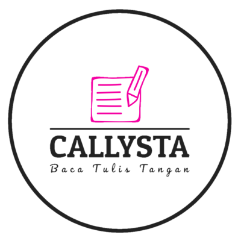

# Callysta Android Application 
GitHub Repositories of Bangkit Academy 2023 Capstone Project from team PS363 learning path Mobile Development 

## About Project
**Callysta (Baca Tulis Tangan)** is a handwriting alphabet uppercase A-Z recognition and speech-to-text application. The primary goal of this project is to provide a convenient and accurate solution for recognizing and transcribing handwritten uppercase alphabets.

## Members
This project is developed by team C23-PS363 of Bangkit Academy 2023 Capstone Project
Name | Bangkit ID | Learning Path | Github Profile
:---|:---:|:---:|---:
Ega Fernanda Putra | M038DSX0496 | Machine Learning | [Profile](https://github.com/Fallennnnnn)
Muhammad Raffi Priyadiantama| M038DSX0498 | Machine Learning | [Profile](https://github.com/Raffi-072)
Muhammad Naufal A. |  A013DSX2909 | Mobile Development | [Profile](https://github.com/mhmmdnaufall)
Danil Ardi | A013DSX0990 | Mobile Development | [Profile](https://github.com/danilardi)
Ridho Kartoni Pasaribu | C013DSX0978 | Cloud Computing | [Profile](https://github.com/ridhokartoni)
Ruben Tricahya Boediono | C038DSX0600 | Cloud Computing | [Profile](https://github.com/rubenboediono)

## Feature 
- Handwriting Alphabet Recognition: The application allows users to write or draw uppercase alphabets directly on the screen using a touch or stylus input
- Speech-to-Text Conversion: In addition to the handwriting recognition feature, Callysta also offers a speech-to-text conversion functionality. Users can speak into the application, and the integrated speech recognition system will transcribe the spoken words into text format.

## Technology Used in this application
- Android Studio
- Kotlin
- Glide 
- OKHttp3
- Android Draw 
- Retrofit
- Android Wave Recorder

## Application Preview

# Step By Step Using the Feature
## How to use Handwriting Alphabet Recognition Feature
- Open the Application
- Go to "Tulis" Section 
- Choose "Belajar"
- Choose Level 
- See Videos to draw and Draw in the canvas
- Click "Periksa" to check if your answer is right and Click "Hapus" if you want to delete ur drawing
- Next Level will be unlocked if previous level is cleared :D

## How to use Speech to Text Feature
- Open the Application
- Go to "Baca" Section 
- Choose "Latihan"
- Choose Level 
- Allow microphone in your device
- Read the question picture 
- Hold microphone icon and answer the question
- If you want to hear your beautiful voice click play button beside microphone 
- Click "Periksa" to check if your answer is right
- Next Level will be unlocked if previous level is cleared :D

# Collaboration Resources
- [Machine Learning](https://github.com/Callysta-Bangkit-Capstone-Project/Callysta-Machine-Learning)
- [Cloud Computing](https://github.com/Callysta-Bangkit-Capstone-Project/Callysta-CloudComputing)
